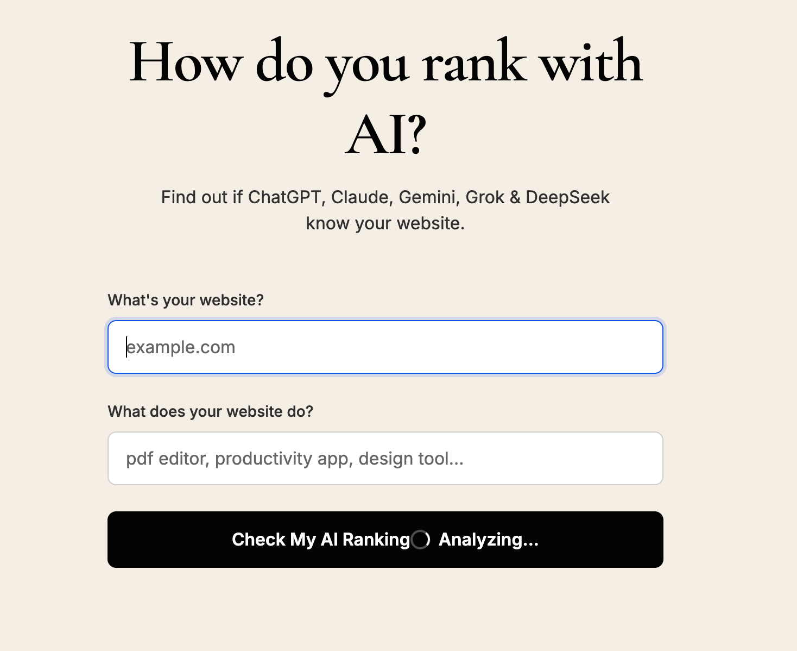

# AI Rank - How do you rank with AI?

SaaS that analyzes how visible a website is in ChatGPT responses. Enter your URL and category, get an AI visibility score and suggestions to improve.

## Features

- **Landing page** – Clean, minimal UI with "What's your website?" and "What does it do?"
- **Analysis** – Runs 20–50 prompts against ChatGPT and detects mentions
- **Visibility score** – Percentage of prompts where your site was mentioned
- **Suggestions** – Keyword swaps and tips so AI can recognise you better


## Landing Page




**POST** `/analyse`

Request body:

```json
{
  "website": "examplepdf.com",
  "category": "pdf editor"
}
```

Response:

```json
{
  "website": "examplepdf.com",
  "category": "pdf editor",
  "visibility_score": 20.0,
  "prompts_tested": 50,
  "mentions_found": 10,
  "mention_rate": 0.2,
  "prompt_results": [
    { "prompt": "best pdf editor", "mentioned": false },
    { "prompt": "free pdf editor", "mentioned": true }
  ]
}
```

## Project Structure

```
app/
├── models/
│   └── analysis_models.py   # Pydantic request/response models
├── routers/
│   └── analysis_router.py   # HTTP endpoint
├── services/
│   ├── analysis_service.py  # Orchestrates pipeline
│   ├── chatgpt_client.py    # OpenAI API client
│   ├── prompt_generator.py  # Generates category prompts
│   └── scoring_service.py   # Visibility score calculation
└── utils/
    └── mention_detector.py  # Website mention detection
```
